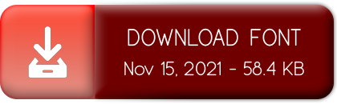

# [miXTim font family](https://github.com/miXTim)


Introducing “miXTim” –a modern geometric sans-serif typeface, inspired by elegance.<br>
Designed with clean and stylized contemporary geometry, «miXTim» is a type system with high refined curves which focus on Clarity & Legibility.


## miXTim Regular: free sans-serif font with ligatures
> miXTim Font is a **modern typeface** which focus on Clarity & Legibility.<br>
> Live demo [_here_](https://www.example.com).

## Table of Contents
* [What's included?](#What's-included?)
* [Technologies Used](#technologies-used)
* [Download & Install](#download-&amp;-install)
* [Browser support](#browser-support)
* [Project status](#project-status)
* [Contact](#contact)
* [Copyright and license](#copyright-and-license)

## What's included?
- Files: mixtim-regular
- Format files: TTF, EOT, WOFF, WOFF2
- 1 weight: Regular (Bold and Thin on demand)
- Multiple Language supported

## Technologies Used
- Inkscape 1.0
- Glyphr Studio 1.1
- [Convertio.co](https://convertio.co/)
- [FontSquirrel](https://www.fontsquirrel.com/tools/webfont-generator)

### Download & Install
<a href="https://github.com/miXTim/fonts/archive/refs/tags/v1.0.0.zip"></a>

### Browser support
```html
<!-- HTML -->
<link rel="preconnect" href="https://github.com">
<link href="https://github.com/miXTim/fonts/blob/main/mixtim-regular.woff">
```

```css
/* Specify in CSS*/
code @font-face { font-family: 'miXTim-regular', sans-serif;
    src: url('mixtim-regular.eot');
    src: url('mixtim-regular.eot?#iefix') format('embedded-opentype'),
         url('mixtim-regular.ttf') format('truetype'),
         url('mixtim-regular.woff2') format('woff2'),
         url('mixtim-regular.woff') format('woff'),
         url('miXTim-Regular.svg#mixtimregular') format('svg');
    font-weight: normal;
    font-style: normal;
}

@supports (font-variation-settings: normal) {
  code { font-family: 'miXTim-regular', sans-serif; }
}
```

## Project Status
Project is: _in progress_

## Contact
Created by [@miXTim](https://twitter.com/juande4u/) - feel free to contact me!
Tweet this: [](https://twitter.com/intent/tweet?text=Wow: NEW Font Released! Introducing miXTim Regular, a modern geometric and humanist sans-serif typeface based in Clarity & Legibility. Check it out here! &url=https%3A%2F%2Fgithub.com%2FmiXTim%2Ffonts)

## Copyright and license


Code copyright 2021 Juande Megias Roca. Code released under the [SIL Open Font License 1.1](https://github.com/miXTim/fonts/blob/main/LICENSE).

Thanks for viewing/downloading ;)
